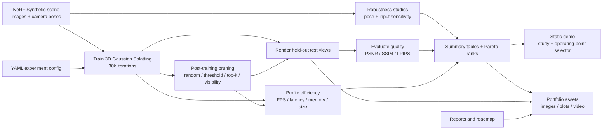

# Pipeline Diagram

This diagram summarizes the current Pareto-Splat workflow from dataset setup
through portfolio assets.



The main quality-efficiency objective used by the Pareto summaries is:

```math
f(x) =
\left[
\mathrm{PSNR}(x),
\mathrm{FPS}(x),
-\mathrm{SizeMiB}(x)
\right].
```

For two operating points \(a\) and \(b\), \(a\) dominates \(b\) when:

```math
\forall j,\; f_j(a) \ge f_j(b)
\quad \text{and} \quad
\exists j,\; f_j(a) > f_j(b).
```

The portfolio assets are the presentation layer for this pipeline. They do not
change the experiments; they package already-computed renders, plots, and
videos into a smaller local bundle for review.
